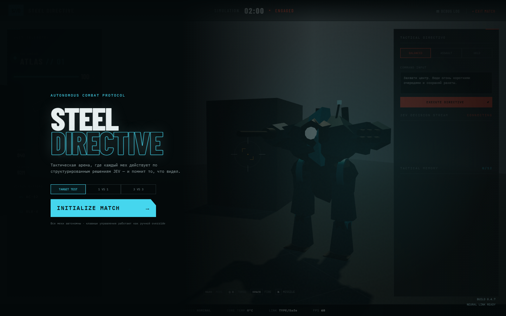
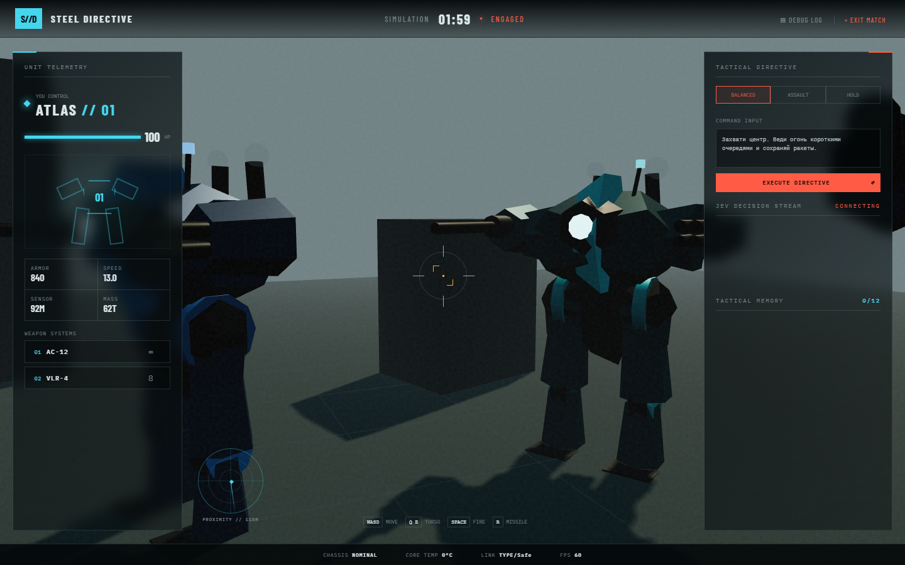

# STEEL//DIRECTIVE

Браузерный vertical slice игры про автономных мехов на Three.js. В демо есть раздельный поворот шасси и торса, два разных loadout'а, укрытия, line-of-sight, ограниченный угол зрения, тактическая память и параллельные каналы решений.

## Скриншоты





## Запуск

```bash
python server.py
```

Откройте `http://localhost:8000`. Ключ читается из `.env` (`KEY` или `TYPESAFE_API_KEY`) только сервером и не отправляется в браузер. Первый запуск требует интернет: Three.js, шрифты и ответы TypeSafe загружаются по сети.

Доступны три режима: `TARGET TEST` — один автономный мех ищет и уничтожает неподвижную цель; `1 VS 1` — дуэль двух мехов; `3 VS 3` — командный бой с одним усиленным мехом в каждой команде. Каждый активный мех независимо получает решения JEV.

Управление: `W/S` — вперёд/назад, `A/D` — поворот шасси, `Q/E` — поворот торса, `Space` — автопушка, `R` — ракета.

## Контракт автономного управления

На каждом decision tick формируется единый `snapshot`: состояние самого меха, видимый противник (только внутри FOV и при чистой линии обзора), последние 12 срезов памяти, стратегия и текстовая директива. Четыре независимых канала возвращают части команды:

```js
{
  navigation: { turn, throttle, strafe },
  torso: { yaw },
  targeting: { track, targetId },
  weapon: { primary, secondary }
}
```

Функция `decide()` сейчас реализована локально, поэтому бой не зависит от сети. Для интеграции TypeSafe её каналы можно вынести в параллельные запросы, валидировать числовые/категориальные ответы, а итоговую команду применять в симуляции. Практичная схема — TypeSafe отвечает на 2–4 Гц за стратегические решения, а движение и прицеливание интерполируются локально на 60 FPS.
