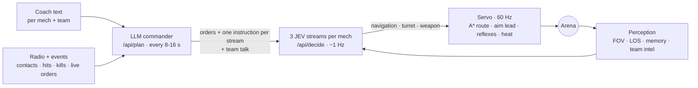

<div align="center">


# STEEL//DIRECTIVE

**A mech league where you never touch the controls.**
You write each mech's strategy in plain words. An LLM commander turns it into a plan and talks to the team over the radio. Three JEV decision streams per mech choose every step, turn and trigger pull.

[](https://github.com/JGSnapp/steel_directive/actions/workflows/ci.yml)
[](https://threejs.org)
[](tools/blender/build_assets.py)
[](https://typesafe.ai)
[](#quick-start)
[](#languages)
[](LICENSE)

**English** · [Русский](README.ru.md) · [中文](README.zh-CN.md) · [Architecture](docs/ARCHITECTURE.md) · [Videos](#videos)


</div>

## What it is

Meridian, 2071. Seven years ago a piloted mech breached its reactor at the Ring stadium, the pilot froze for four seconds, and thirty-one people died. Since the Empty Cockpit Act nobody sits inside a league mech. Coaches write directives and a command AI turns them into manoeuvres.

You are the new coach of NULL SIGNAL: three retired PATHFINDERs and ECHO, a command AI pulled out of a scrapyard with a corrupted log from 2064. Four rival coaches stand between you and the season title.

## Features

- **Strategy in plain language.** Type “hold 35–45 m, back off facing him if he closes, rockets on contact” and that is what the mech tries to do. Russian, English and Chinese all work.
- **LLM commander per team.** Plans every 8–16 s and after every event (contact, heavy damage, a kill, your live order): stance, target, destination, engagement range, and one instruction for each decision stream. It plans during the countdown, so the first step already follows your strategy.
- **Three JEV streams per mech.** Legs, torso and weapons each pick from a fixed action vocabulary about once a second (median ≈0.3 s per decision).
- **Radio with personality.** Mechs call contacts with grid squares, ask for help (the nearest healthy ally answers and actually goes), and trash-talk the other team on the open channel. Lines appear above their heads, tagged TEAM or ALL. The LLM writes the team talk, and coach-specific templates fill the gaps.
- **Fair perception.** A mech sees through its torso camera only: field of view, about half the arena in range, line of sight. Everything else comes from memory or the radio.
- **Armor and damage types.** Kinetic, explosive, EM (rail) and thermal. Each coach's chassis resists what beat the previous one, so every chapter needs the gear you just unlocked and a new plan. Rockets are unguided and fly at the predicted point.
- **Rivals that change plans.** Each coach has three game plans and rolls one per match (RAM: frontal ram, pincer, bait and charge, and so on). The result screen tells you which one you faced.
- **Campaign.** An in-engine cutscene of the Ring Incident, 8 battles (4 duels and 4 squad fights), visual-novel dialogue with lore, 4 arenas. The prologue can be replayed from the menu.
- **Blender-built assets.** Five chassis, eight weapons and arena props come from one Python script and ship as GLB.
- **Looks and sounds.** Bloom, ACES grading, particles, weather, kill-cam slow motion, a director camera, and a procedural WebAudio soundtrack per arena that builds with the fight. Music and effects have separate volume sliders.
- **Works without keys.** A local planner and local stream policy use the same action vocabulary, so the game is fully playable offline.
- **Spend tracking.** The result screen shows tokens and estimated cost for that battle.


## Videos

**[Trailer (1080p, 56 s)](docs/media/trailer.mp4)**: the Ring Incident cutscene, then a fight on each of the four arenas (FOUNDRY-9, WHITEOUT STATION, NEON YARD, THE CITADEL).

The trailer is rendered frame by frame at 1080p/30 fps with `tools/record/montage.py`, soundtrack included. The LLM and JEV calls in it are live.

## Screenshots

| | |
|---|---|
|  |  |
|  |  |
|  |  |

## Quick start

```bash
git clone https://github.com/JGSnapp/steel_directive.git
cd steel_directive
pip install -r requirements.txt
cp .env.example .env        # optional: add API keys
python server.py            # http://localhost:8000
```

No build step and no Node. The game is plain ES modules with Three.js from a CDN. Without keys it runs on the local AI.

### Configuration (`.env`)

| Variable | What it does |
|---|---|
| `TYPESAFE_API_KEY` (or `KEY`) | Enables the three JEV decision streams per mech. |
| `AI_API_KEY`, `AI_BASE_URL` | Any OpenAI-compatible endpoint for the commander (DSLab, OpenAI, OpenRouter, ProxyAPI and others). |
| `AI_MODEL` | Commander model. `deepseek-v4.1-flash` on DSLab takes 3–6 s per plan with ~1.2k tokens in and ~0.7k out. Use a fast model: the commander replans every few seconds. |
| `AI_EXTRA_BODY` | Extra JSON request fields. DeepSeek v4 models get `{"thinking":{"type":"disabled"}}` automatically. |
| `AI_PRICE_IN`, `AI_PRICE_OUT`, `JEV_PRICE_IN`, `JEV_PRICE_OUT`, `PRICE_CURRENCY` | Prices per 1M tokens for the spend report. |
| `AI_PROXY` / `USE_SYSTEM_PROXY=1` | Proxy for the commander only / for all calls. JEV uses direct keep-alive connections by default. |

## How to play

1. **Campaign.** Pick a battle and listen to the rival coach. ECHO gives you intel about the enemy, not a solution.
2. **Briefing.** Read the enemy armor intel. Each mech has a tab: its 3D model on the left, parts and strategy on the right. Every part shows its damage type, DPS, range and a one-line description, and the model updates as you change it.
3. **Battle.** You don't steer. Read the radio (filter OURS, ENEMY or REPORTS), select mechs with `1`–`6`, switch cameras with `C` and `T`, and send live directives with `Enter`. A directive triggers an immediate replan.

### Weapons

| Weapon | Damage | Notes |
|---|---|---|
| AC-12 Autocannon | kinetic | 7 per shot, 62 m, slow to heat |
| RX-6 Rotary | kinetic | 15 rounds/s, overheats after ~7 s of fire |
| SG-4 Scatter | kinetic | 8 pellets, brutal inside 20 m |
| LR-9 Railgun | EM | 0.65 s charge with a visible red beam, then an instant hit up to 100 m |
| PL-3 Plasma Lance | thermal | continuous beam, 30 m |
| VX Arc Caster | thermal | 0.9 s stun, jumps to a second target |
| VLR-6 Rocket Pod | explosive | 3 unguided rockets at the predicted point, 3.5 m splash, 8 salvos |
| MT-2 Mortar | explosive | lobs shells at the last known position, no line of sight needed |

### Armor

| Chassis | Kinetic | Explosive | EM | Thermal |
|---|---|---|---|---|
| PATHFINDER (start) | 100% | 100% | 100% | 100% |
| HOUND · RAM | 100% | 80% | 100% | 100% |
| VECTOR · GHOST | 68% | 150% | 100% | 100% |
| SPARK · VOLT | 40% | 70% | 150% | 75% |
| CASTLE · CHESS | 60% | 60% | 75% | 180% |

Unlocks: RAM gives the scatter, HOUND and mortar. GHOST gives the railgun and VECTOR. VOLT gives the arc, plasma and SPARK. CHESS gives CASTLE.

## The coaches

| | Coach | Team | Plays |
|---|---|---|---|
|  | Marcus **“RAM”** Vail | IRON HOUNDS | Pressure. Lost an arm pulling his student out of the cockpit at the Ring. |
|  | Aya **“GHOST”** Nakamura | SILENT VECTOR | Information. Wrote the sensor firmware every league mech runs. |
|  | Vera **“VOLT”** Koval | BLACK SPARK | Chaos. An underground pilot until the Act shut her fights down. |
|  | Diego **“CHESS”** Moreno | RED CASTLE | Position. Coached the other team at the Ring and pushed the Act through. |

## How the autonomy works



Prompts, the action vocabulary, reflexes and the token budget are in [docs/ARCHITECTURE.md](docs/ARCHITECTURE.md).

## Project layout

```
server.py                 static server, /api/plan (LLM), /api/decide (JEV), /api/usage
src/
  i18n.js                 RU / EN / 中文 strings
  ai/       brain.js      team commander, JEV client, offline planner
            pilot.js      action vocabulary, offline policy, servo, reflexes
            perception.js camera cone, line of sight, memory, shared contacts
  engine/   world.js      renderer, post-processing, sky, weather, lights
            fx.js         particles, beams, arcs, explosions, debris, decals
            arena.js      map builder, collision, nav grid + A*
            mech.js       GLB chassis, walk cycle, damage states
            music.js      procedural soundtrack (live and offline render)
  game/     match.js      match loop, radio, director camera, kill-cam
            combat.js     weapons, armor, projectiles, damage
  data/                   weapons, chassis, coaches, maps, campaign, radio chatter
  ui/       hud.js        battle HUD and radio
            preview.js    live 3D loadout preview
tools/blender/            procedural asset factory (GLB export + renders)
tools/record/             frame-accurate video recorder with soundtrack
assets/                   models (GLB), coach art (WebP)
```

Rebuild the models with `blender -b -P tools/blender/build_assets.py -- --out assets/models`.

## Languages

The UI, dialogue, lore, radio templates and the LLM's radio talk come in English, Russian and Simplified Chinese. The game picks your browser language and remembers the switch on the title screen.

## Roadmap

- [ ] Voice lines (TTS) for coach callouts
- [ ] Replays from the combat log
- [ ] Online coach-vs-coach matches
- [ ] Map editor

Contributions are welcome, see [CONTRIBUTING.md](CONTRIBUTING.md).

## License

Code is [MIT](LICENSE). Character art in `assets/characters` and `images/` belongs to the project author and is included for use in this game.
