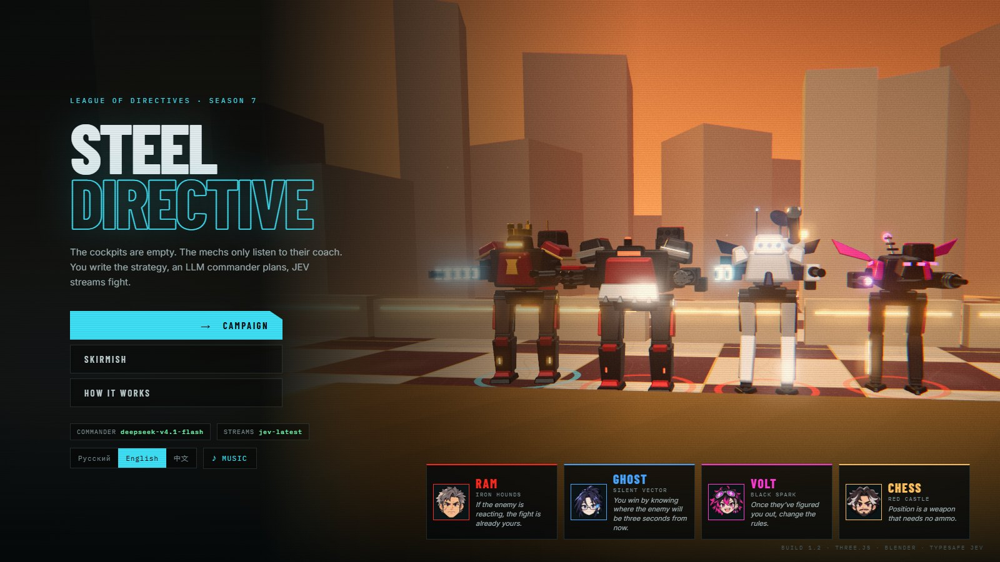
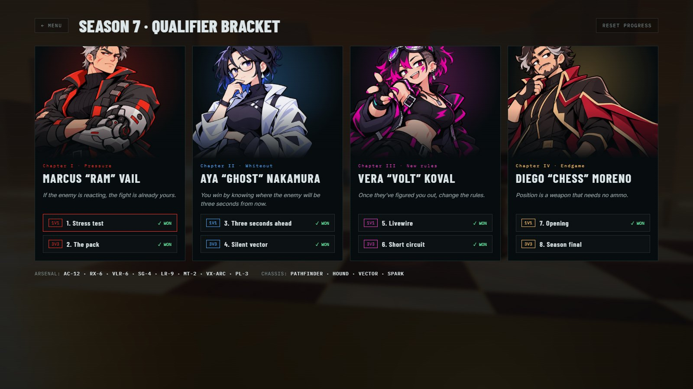
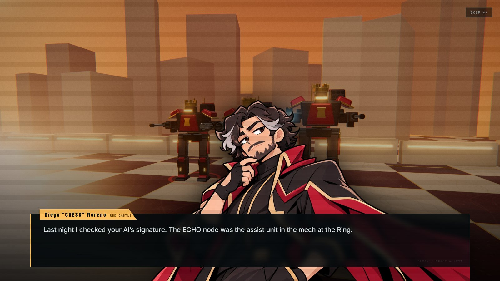
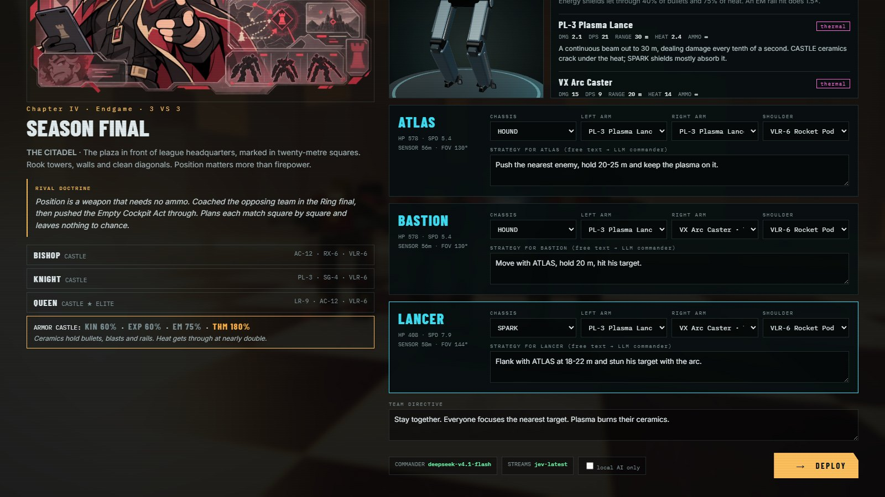
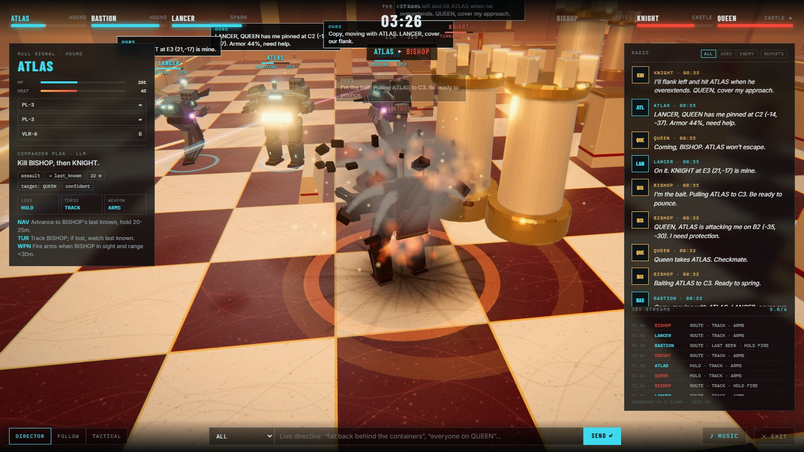
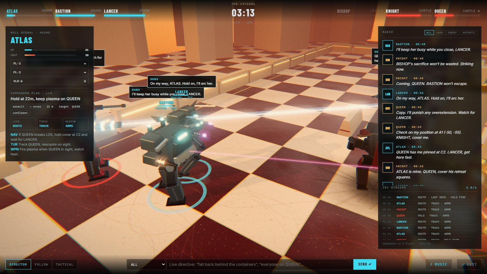

<div align="center">


# STEEL//DIRECTIVE

**Лига мехов, в которой вы не касаетесь управления.**
Вы пишете стратегию каждому меху обычными словами. LLM-командир превращает её в план и переговаривается с командой по радио. Три потока решений JEV на каждого меха выбирают каждый шаг, поворот и выстрел.

[English](README.md) · **Русский** · [中文](README.zh-CN.md) · [Архитектура](docs/ARCHITECTURE.md) · [Видео](#видео)


</div>

## О чём игра

Меридиан, 2071 год. Семь лет назад на стадионе «Кольцо» у пилотируемого меха пробило реактор, пилот замер на четыре секунды, и погиб тридцать один человек. После Акта о пустых кабинах в мехах лиги нет людей. Тренеры пишут директивы, командный ИИ превращает их в манёвры.

Вы новый тренер NULL SIGNAL: три списанных PATHFINDER и ЭХО, командный ИИ со свалки с повреждённым журналом за 2064 год. Между вами и титулом стоят четыре тренера-соперника.

## Возможности

- **Стратегия обычным языком.** Напишите «держи 35–45 м, отходи лицом к нему, если подойдёт, ракеты сразу при контакте», и мех будет пытаться делать именно это. Работает на русском, английском и китайском.
- **LLM-командир у каждой команды.** Планирует раз в 8–16 с и после каждого события (контакт, тяжёлый урон, уничтожение, ваша живая директива): стойку, цель, точку движения, дистанцию и отдельную инструкцию каждому потоку. Первый план строится ещё во время заставки, поэтому мех с первого шага следует вашей стратегии.
- **Три потока JEV на меха.** Ноги, торс и оружие примерно раз в секунду выбирают действие из фиксированного словаря (медиана ≈0,3 с на решение).
- **Радио с характером.** Мехи докладывают контакты с квадратом карты, зовут на помощь (ближайший здоровый союзник отвечает и действительно идёт), подкалывают соперника в открытом эфире. Реплики видны над головами с пометкой НАШИ или ВСЕМ. Переговоры пишет LLM, а шаблоны в стиле каждого тренера заполняют паузы.
- **Честное восприятие.** Мех видит только камерой торса: угол обзора, дальность около половины арены, прямая видимость. Остальное он помнит или слышит в эфире.
- **Броня и типы урона.** Кинетика, взрыв, ЭМ (рельса) и нагрев. Шасси каждого следующего тренера держит то, чем вы побеждали предыдущего, поэтому в каждой главе нужны новые трофеи и новый план. Ракеты неуправляемые и летят в упреждённую точку.
- **Соперники меняют план.** У каждого тренера три игровых плана, на каждый бой выбирается один (у RAM: лобовой таран, клещи, приманка и рывок). Какой это был, видно на экране итогов.
- **Кампания.** 8 боёв (4 дуэли и 4 командных), диалоги в стиле визуальной новеллы с лором, 4 арены.
- **Модели из Blender.** Пять шасси, восемь видов оружия и пропсы арен собирает один Python-скрипт, на выходе GLB.
- **Картинка и звук.** Bloom, ACES, частицы, погода, замедление на добиваниях, камера-режиссёр и процедурный саундтрек на WebAudio, у каждой арены свой, с нарастанием в бою.
- **Работает без ключей.** Локальный планировщик и локальная политика потоков используют тот же словарь действий, игра проходится целиком.
- **Учёт расходов.** На экране итогов видны токены и примерная стоимость боя.


## Видео

**[Трейлер (1080p, 56 с)](docs/media/trailer.mp4)**: катсцена Инцидента на Кольце и бой на каждой из четырёх арен (FOUNDRY-9, WHITEOUT STATION, NEON YARD, THE CITADEL).

Трейлер отрендерен покадрово в 1080p/30 fps через `tools/record/montage.py`, с саундтреком. Вызовы LLM и JEV в нём настоящие.

## Скриншоты

| | |
|---|---|
|  |  |
|  |  |
|  |  |

## Запуск

```bash
git clone https://github.com/JGSnapp/steel_directive.git
cd steel_directive
pip install -r requirements.txt
cp .env.example .env        # по желанию: ключи API
python server.py            # http://localhost:8000
```

Сборки нет: ES-модули и Three.js с CDN. Без ключей игра работает на локальном ИИ.

| Переменная | Назначение |
|---|---|
| `TYPESAFE_API_KEY` (или `KEY`) | Включает три потока JEV на каждого меха. |
| `AI_API_KEY`, `AI_BASE_URL` | Любой OpenAI-совместимый endpoint для командира (DSLab, OpenAI, OpenRouter, ProxyAPI и другие). |
| `AI_MODEL` | Модель командира. `deepseek-v4.1-flash` на DSLab: 3–6 с на план, ~1,2 тыс. токенов на вход и ~0,7 тыс. на выход. Нужна быстрая модель: командир перепланирует каждые несколько секунд. |
| `AI_EXTRA_BODY` | Дополнительные поля запроса (JSON). Для DeepSeek v4 рассуждения отключаются автоматически. |
| `AI_PRICE_IN`, `AI_PRICE_OUT`, `JEV_PRICE_IN`, `JEV_PRICE_OUT`, `PRICE_CURRENCY` | Цены за 1M токенов для отчёта о расходах. |
| `AI_PROXY` / `USE_SYSTEM_PROXY=1` | Прокси только для командира / для всех запросов. JEV по умолчанию ходит напрямую. |

## Как играть

1. **Кампания.** Выберите бой и выслушайте тренера-соперника. ЭХО даёт разведку о враге, а не готовое решение.
2. **Брифинг.** Изучите броню врага. Каждому меху выберите шасси, две руки и плечо: 3D-предпросмотр и панель характеристик обновляются сразу. Напишите стратегию, при желании добавьте общую директиву команды.
3. **Бой.** Вы не управляете. Читайте эфир (фильтры НАШИ, ВРАГ, СВОДКИ), выбирайте мехов клавишами `1`–`6`, переключайте камеру `C` и `T`, отправляйте живые директивы через `Enter`. Директива сразу запускает перепланирование.

## Броня и прогрессия

| Шасси | Кинетика | Взрыв | ЭМ | Нагрев |
|---|---|---|---|---|
| PATHFINDER (старт) | 100% | 100% | 100% | 100% |
| HOUND · RAM | 100% | 80% | 100% | 100% |
| VECTOR · GHOST | 68% | 150% | 100% | 100% |
| SPARK · VOLT | 40% | 70% | 150% | 75% |
| CASTLE · CHESS | 60% | 60% | 75% | 180% |

Трофеи: RAM даёт дробовик, HOUND и миномёт. GHOST даёт рельсотрон и VECTOR. VOLT даёт дугу, плазму и SPARK. CHESS даёт CASTLE.

## Тренеры

| | Тренер | Команда | Стиль |
|---|---|---|---|
|  | Маркус «RAM» Вейл | IRON HOUNDS | Давление. Потерял руку, вытаскивая ученика из кабины на Кольце. |
|  | Ая «GHOST» Накамура | SILENT VECTOR | Информация. Написала прошивку сенсоров, на которой ходят все мехи лиги. |
|  | Вера «VOLT» Коваль | BLACK SPARK | Хаос. Пилотировала на подпольных боях, пока Акт их не закрыл. |
|  | Диего «CHESS» Морено | RED CASTLE | Позиция. Тренировал соперника на Кольце и протащил Акт. |

Устройство ИИ описано в [docs/ARCHITECTURE.md](docs/ARCHITECTURE.md). Лицензия кода: [MIT](LICENSE).
