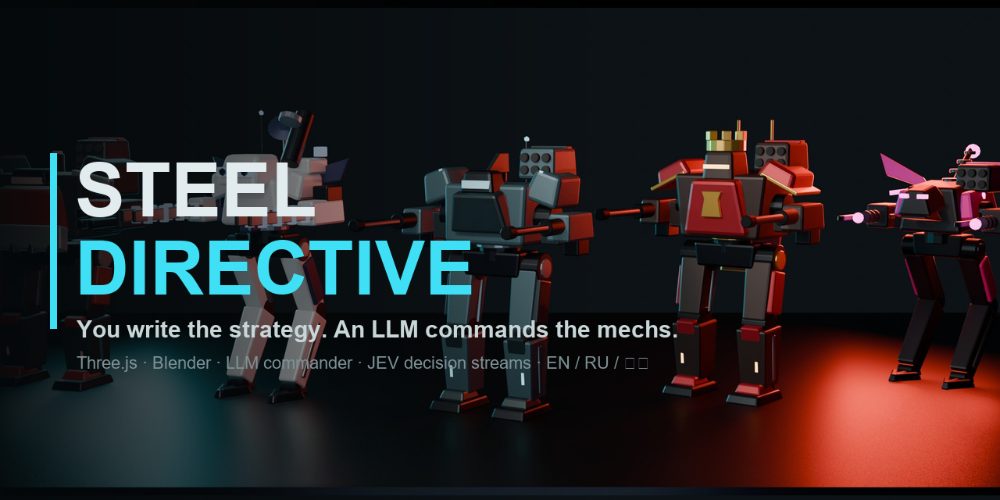
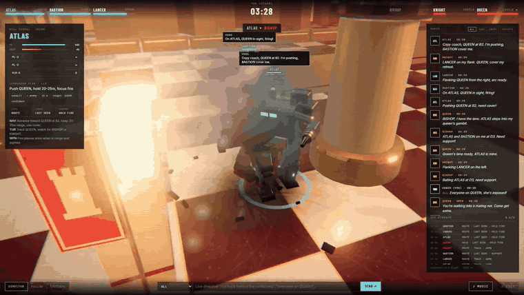
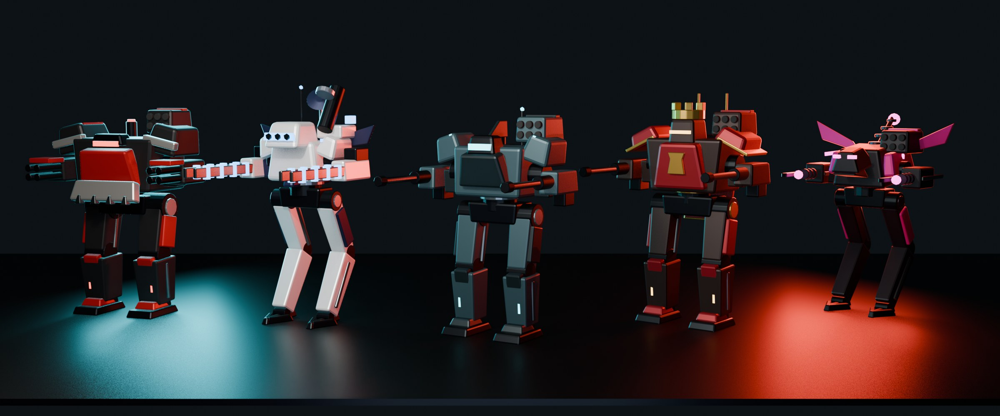

<div align="center">



# STEEL//DIRECTIVE

**一个你永远不碰操纵杆的机甲联赛。**
你用日常语言为每台机甲写下战略。LLM 指挥官把它变成计划，并通过无线电和队伍交流。每台机甲的三条 JEV 决策流决定每一步、每一次转身和每一次开火。

[English](README.md) · [Русский](README.ru.md) · **中文** · [架构](docs/ARCHITECTURE.md) · [视频](#视频)



</div>

## 故事背景

子午城，2071 年。七年前，在“环形”体育场，一台有人驾驶的机甲反应堆破裂，驾驶员僵住了四秒，三十一人死亡。《空驾驶舱法案》通过后，联赛机甲里再也没有人。教练写下指令，指挥 AI 把它们变成战术动作。

你是 NULL SIGNAL 的新教练：三台退役的 PATHFINDER，加上 ECHO，一个从废料场捡回来、带着 2064 年损坏日志的指挥 AI。你和赛季冠军之间，隔着四位对手教练。

## 特色

- **用日常语言写战略。** 写下“保持 35–45 米，他靠近就面向他后撤，接敌立即发射火箭”，机甲就会尽力照做。支持中文、英文和俄文。
- **每支队伍一个 LLM 指挥官。** 每 8–16 秒以及每次事件后（接敌、重创、击毁、你的实时指令）重新规划：姿态、目标、移动点、交战距离，并为每条决策流写一条指令。倒计时期间就开始规划，第一步就遵循你的战略。
- **每台机甲三条 JEV 决策流。** 腿、躯干和武器约每秒从固定词表中各选一个动作（每次决策中位数约 0.3 秒）。
- **有性格的无线电。** 机甲用网格坐标报告敌情，呼叫支援（最近的健康队友会回应并真的赶过去），在公开频道嘲讽对手。台词显示在机甲头顶，标注“我方”或“公开”。队内对话由 LLM 撰写，各教练风格的模板填补空档。
- **公平的感知。** 机甲只能通过躯干摄像头观察：视角、约半个场地的距离、视线。其余信息来自记忆或无线电。
- **装甲与伤害类型。** 动能、爆炸、电磁（电磁炮）和热能。每位教练的底盘都抗住了你击败上一位时用的武器，所以每一章都需要新解锁的装备和新的计划。火箭无制导，飞向预判位置。
- **会换打法的对手。** 每位教练有三种打法，每场随机选一种（RAM：正面冲撞、钳形攻势、诱饵与冲锋）。结算界面会告诉你对手用了哪一种。
- **战役。** 8 场战斗（4 场单挑、4 场团队战），带背景故事的视觉小说式对话，4 个竞技场。
- **Blender 生成的模型。** 五种底盘、八种武器和场景道具由一个 Python 脚本生成，导出为 GLB。
- **画面与声音。** Bloom、ACES 调色、粒子、天气、击杀慢镜头、导播镜头，以及每个竞技场专属、随战斗升温的 WebAudio 程序化配乐。
- **无需密钥也能玩。** 本地规划器和本地决策策略使用同一套动作词表，整个游戏都能离线通关。
- **消耗统计。** 结算界面显示本场的 token 用量和估算费用。



## 视频

**[预告片（1080p，56 秒）](docs/media/trailer.mp4)**：环形事件过场，以及四个竞技场（FOUNDRY-9、WHITEOUT STATION、NEON YARD、THE CITADEL）各一场战斗。

预告片由 `tools/record/montage.py` 以 1080p/30 fps 逐帧渲染，并配有原声。其中的 LLM 和 JEV 调用都是真实的。

## 快速开始

```bash
git clone https://github.com/JGSnapp/autolock_bots.git
cd autolock_bots
pip install -r requirements.txt
cp .env.example .env        # 可选：填写 API 密钥
python server.py            # http://localhost:8000
```

无需构建，无需 Node。游戏是纯 ES 模块，Three.js 通过 CDN 加载。没有密钥时使用本地 AI。

| 变量 | 作用 |
|---|---|
| `TYPESAFE_API_KEY`（或 `KEY`） | 启用每台机甲的三条 JEV 决策流。 |
| `AI_API_KEY`、`AI_BASE_URL` | 任何兼容 OpenAI 的指挥官接口（DSLab、OpenAI、OpenRouter、ProxyAPI 等）。 |
| `AI_MODEL` | 指挥官模型。DSLab 上的 `deepseek-v4.1-flash` 每次计划 3–6 秒，约 1.2k 输入、0.7k 输出 token。请选快速模型，指挥官每隔几秒就会重新规划。 |
| `AI_EXTRA_BODY` | 额外的请求字段（JSON）。DeepSeek v4 模型会自动关闭思考模式。 |
| `AI_PRICE_IN`、`AI_PRICE_OUT`、`JEV_PRICE_IN`、`JEV_PRICE_OUT`、`PRICE_CURRENCY` | 消耗报告使用的每百万 token 价格。 |

## 玩法

1. **战役。** 选择一场战斗，听对手教练说话。ECHO 提供敌方情报，而不是现成答案。
2. **简报。** 查看敌方装甲情报。为每台机甲选择底盘、两只手臂武器和一件肩部武器，3D 预览和参数面板会实时更新。然后写下它的战略，也可以加一条全队指令。
3. **战斗。** 你不直接操控。阅读无线电（筛选“我方”“敌方”“战报”），按 `1`–`6` 选择机甲，`C` 和 `T` 切换镜头，`Enter` 发送实时指令，指令会立即触发重新规划。

## 装甲与进度

| 底盘 | 动能 | 爆炸 | 电磁 | 热能 |
|---|---|---|---|---|
| PATHFINDER（初始） | 100% | 100% | 100% | 100% |
| HOUND · RAM | 100% | 80% | 100% | 100% |
| VECTOR · GHOST | 68% | 150% | 100% | 100% |
| SPARK · VOLT | 40% | 70% | 150% | 75% |
| CASTLE · CHESS | 60% | 60% | 75% | 180% |

解锁：RAM 给霰弹枪、HOUND 和迫击炮；GHOST 给电磁炮和 VECTOR；VOLT 给电弧、等离子和 SPARK；CHESS 给 CASTLE。

## 教练

| | 教练 | 队伍 | 风格 |
|---|---|---|---|
|  | 马库斯·“RAM”·维尔 | IRON HOUNDS | 压迫。在“环形”把学生拖出驾驶舱时失去了一条手臂。 |
|  | 中村亚·“GHOST” | SILENT VECTOR | 情报。联赛所有机甲的传感器固件出自她手。 |
|  | 薇拉·“VOLT”·科瓦尔 | BLACK SPARK | 混乱。法案取缔地下格斗之前，她是地下驾驶员。 |
|  | 迭戈·“CHESS”·莫雷诺 | RED CASTLE | 站位。在“环形”执教对方队伍，并推动了法案。 |

AI 架构见 [docs/ARCHITECTURE.md](docs/ARCHITECTURE.md)。代码采用 [MIT](LICENSE) 许可。
